## 是什么？

uni-ajax 是一款基于 [promise](https://javascript.info/promise-basics) 的轻量级 [uni-app](https://uniapp.dcloud.io/) 网络请求库。参考了 [Axios](https://github.com/axios/axios) 的使用方式封装默认的 [request](https://uniapp.dcloud.io/api/request/request) 方法，但更轻量，更灵活，且保留原有的核心。解决了原有请求方法在 uni-app 项目开发中的一些不方便，更切合企业开发的实际需求，开箱即用，配置简单。

如果你有 Axios 的使用经验，相信很快上手。如果没有，别担心，通过这份文档，带你简单上手并深入使用。

## 特性

- 💿 支持 Promise API
- 🏷 支持 TypeScript 开发
- 🎛 拦截请求和响应
- 📦 自定义配置请求实例
- 📡 多种 Method 方法请求
- 🖇 支持 RequestTask 操作

## 链接

- [GitHub](https://github.com/ponjs/uni-ajax)
- [npm](https://www.npmjs.com/package/uni-ajax)
- [插件市场](https://ext.dcloud.net.cn/plugin?id=2351)
- [QQ群 917428107](https://qm.qq.com/cgi-bin/qm/qr?k=a0NaOxj875pQzpGh0MEx5jJPZnKAw_IM&jump_from=webapi)

## 思考

uni-ajax 是基于 Promise 开发的。自然继承了 Promise 链状结构，我们的发起请求时的配置参数从调用到响应，都是从上至下传递。我们不妨思考一下，不同位置链中的函数都是可以对我们的数据操作，所以这就给我们更多扩展性和灵活性，如传值到拦截器、动态处理请求配置、根据响应结果自定义返回内容。

